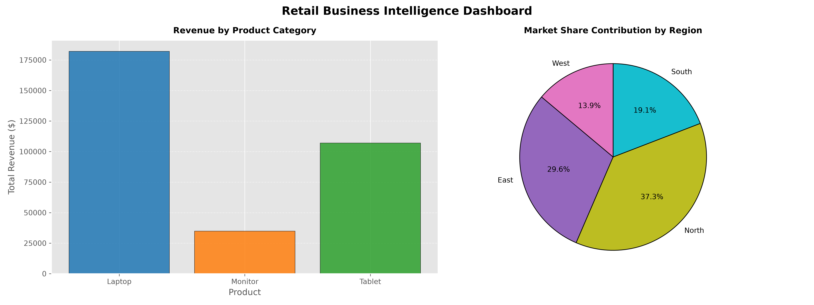

# Advanced Retail Business Intelligence Dashboard

A production-grade Python data analytics pipeline that ingests raw retail transaction data, engineers business-critical metrics, and generates an automated executive dashboard.

## 📊 Project Enhancements
- **Data Preprocessing:** Standardized pipeline with dynamic string stripping and automated formatting safeguards.
- **Feature Engineering:** Calculated total revenue using optimized vectorization and applied custom performance flags (`High_Price_Flag`).
- **Multi-Dimensional Aggregation:** Grouped sales data by both product variants and geographic sectors to extract deep financial insights.
- **Executive Subplots Dashboard:** Generated a 2-in-1 layout combining product revenue bar charts and regional market share pie charts.

## 🛠️ Tech Stack
- **Language:** Python 3.x
- **Libraries:** Pandas, Matplotlib

## 📈 Executive Summary Dashboard
The pipeline automatically exports analytical charts for business stakeholder presentations:

