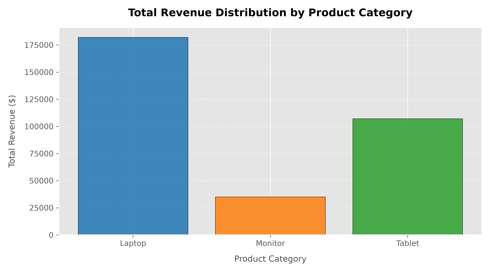

# Exploratory Data Analysis (EDA) on Retail Dataset

A Python-based data analytics pipeline designed to ingest raw retail transaction data, clean and engineer sales metrics, and generate stakeholder-ready visual insights regarding product revenue performance.

## 📊 Core Features
- **Data Preprocessing:** Automated handling of transactional records and structured column alignment.
- **Feature Engineering:** Vectorized operations to compute total revenue and dynamically flag premium products (`High_Price_Flag`).
- **Data Aggregation:** Multi-dimensional segmentation using Pandas GroupBy to isolate top-performing categories.
- **Data Visualization:** Production-grade visualizations built via Matplotlib highlighting sales and distribution trends.

## 🛠️ Tech Stack
- **Language:** Python 3.x
- **Libraries:** Pandas, Matplotlib

## 📈 Visualizations
The pipeline automatically exports analytical charts for business decision-making:

